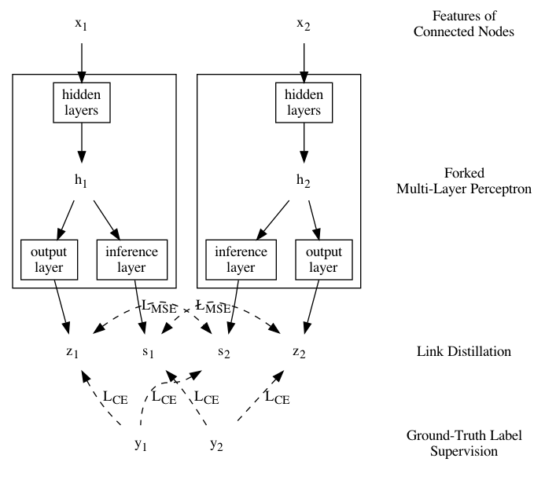
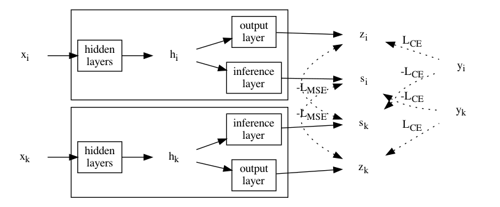

# Distilling Self-Knowledge From Contrastive Links to Classify Graph Nodes Without Passing Messages

*LinkDist* distils self-knowledge from links into a Multi-Layer Perceptron (MLP) without the need to aggregate messages.

Experiments with 8 real-world datasets show the Learnt MLP (named *LinkDistMLP*) can predict the label of a node without knowing its adjacencies but achieve comparable accuracy against GNNs in the contexts of both semi- and full-supervised node classification tasks.

We also introduce Contrastive Learning techniques to further boost the accuracy of LinkDist and LinkDistMLP (as *CoLinkDist* and *CoLinkDistMLP*).

[中文概要](https://cf020031308.github.io/papers/2021-distilling-self-knowledge-from-contrastive-links-to-classify-graph-nodes-without-passing-messages/)





## State of the Art

[](https://paperswithcode.com/sota/node-classification-on-cora?p=distilling-self-knowledge-from-contrastive)

[](https://paperswithcode.com/sota/node-classification-on-citeseer?p=distilling-self-knowledge-from-contrastive)

[](https://paperswithcode.com/sota/node-classification-on-pubmed?p=distilling-self-knowledge-from-contrastive)

[](https://paperswithcode.com/sota/node-classification-on-cora-full?p=distilling-self-knowledge-from-contrastive)

[](https://paperswithcode.com/sota/node-classification-on-amazon-photo-1?p=distilling-self-knowledge-from-contrastive)

[](https://paperswithcode.com/sota/node-classification-on-amazon-computers-1?p=distilling-self-knowledge-from-contrastive)

[](https://paperswithcode.com/sota/node-classification-on-coauthor-cs?p=distilling-self-knowledge-from-contrastive)

[](https://paperswithcode.com/sota/node-classification-on-coauthor-physics?p=distilling-self-knowledge-from-contrastive)

[](https://paperswithcode.com/sota/node-classification-on-cora-with-public-split?p=distilling-self-knowledge-from-contrastive)

[](https://paperswithcode.com/sota/node-classification-on-citeseer-with-public?p=distilling-self-knowledge-from-contrastive)

[](https://paperswithcode.com/sota/node-classification-on-pubmed-with-public?p=distilling-self-knowledge-from-contrastive)

[](https://paperswithcode.com/sota/node-classification-on-cora-full-with-public?p=distilling-self-knowledge-from-contrastive)

| MLP-based Method | [ogbn-arxiv](https://ogb.stanford.edu/docs/leader_nodeprop/#ogbn-arxiv) | [ogbn-mag](https://ogb.stanford.edu/docs/leader_nodeprop/#ogbn-mag) | [ogbn-products](https://ogb.stanford.edu/docs/leader_nodeprop/#ogbn-products) |
|------------------------------------------------|---------------------|---------------------|---------------------|
| MLP                                            | 0.5550 ± 0.0023     | 0.2692 ± 0.0026     | 0.6106 ± 0.0008     |
| MLP + [FLAG](https://github.com/devnkong/FLAG) | 0.5602 ± 0.0019     | -                   | 0.6241 ± 0.0016     |
| CoLinkDistMLP                                  | **0.5638 ± 0.0016** | **0.2761 ± 0.0018** | **0.6259 ± 0.0010** |

## Requirements

Install dependencies [torch](https://pytorch.org/) and [DGL](https://github.com/dmlc/dgl):

```bash
pip3 install torch ogb
```

## Reproducibility

Run the script with arguments `algorithm_name`, `dataset_name`, and `dataset_split`.

* Available algorithms: mlp, gcn, gcn2mlp, linkdistmlp, linkdist, colinkdsitmlp, colinkdist.
  * If the `algorithm_name` ends with `-trans`, the experiment is run with the transductive setting. Otherwise, it is run with inductive setting.
* Available datasets: cora / citeseer / pubmed / corafull / amazon-photo / amazon-com / coauthor-cs / coauthor-phy
  * We divide the dataset into a training set with `dataset_split` out of ten nodes, a validation set and a testing set. If `dataset_split` is 0, we select at most 20 nodes from every class to construct the training set.

The following command experiments **GCN** on **Cora** dataset with the inductive setting:

```bash
python3 main.py gcn cora 0
```

The following command experiments **CoLinkDistMLP** on **Amazon Photo** dataset with the transductive setting, the Amazon Photo dataset is divided into a training set of 60% nodes, a validation set of 20% nodes, and a testing set of 20% nodes:

```bash
python3 main.py colinkdistmlp-trans amazon-photo 6
```

To reproduce all experiments in our paper, run

```bash
bash run
```

The output logs will be saved into `trans.log`, `induc.log`, and `full.log`.

## Citation

```bibtex
@article{2106.08541v1,
  author = {Yi Luo and Aiguo Chen and Ke Yan and Ling Tian},
  eprint = {2106.08541v1},
  month = {Jun},
  title = {Distilling Self-Knowledge From Contrastive Links to Classify Graph Nodes
Without Passing Messages},
  type = {article},
  url = {http://arxiv.org/abs/2106.08541v1},
  year = {2021},
}
```
